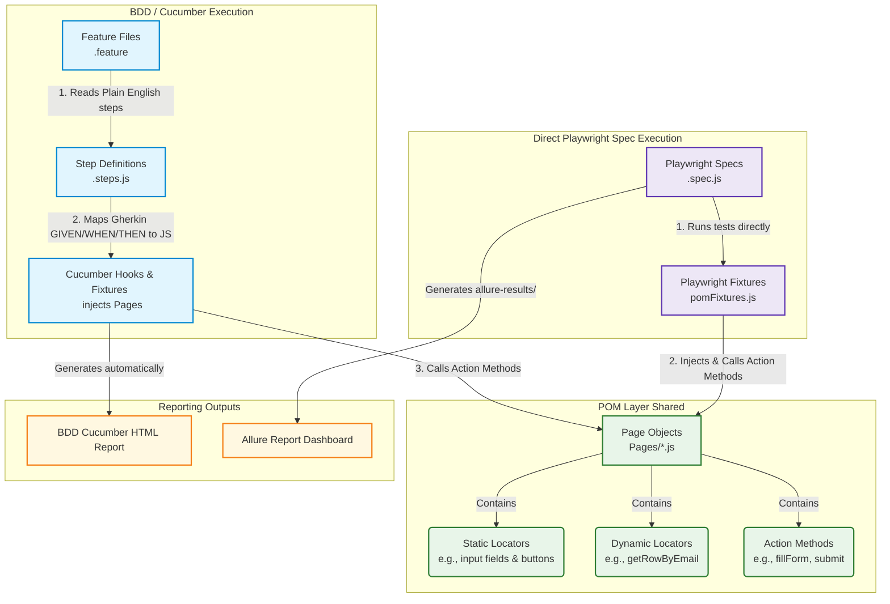

# 🎓 QA Lead Interview Preparation Guide: Test Automation Framework

This guide contains key questions and detailed answers regarding the architecture, sequence flow, and design choices of the **Playwright + Cucumber BDD** automation framework. Use this to prepare for discussions with your QA Lead or team.

---

## 🗺️ System Architecture & Execution Flow



---

## ❓ Core Questions & Answers

### Q1: What is the sequence of execution when running BDD (Cucumber) tests?
**Answer:**
1. **Feature File Reads Step:** Cucumber parses a scenario step in plain English from a `.feature` file (e.g., `When the user searches for book "Git Pocket Guide"`).
2. **Step-Definition Match:** Cucumber matches that step pattern in the `step-definitions/` folder.
3. **Context Hook Setup:** The runner triggers the `Before` hook, spinning up the browser and injecting the required Page Object Model (POM) classes into the custom context (`this`).
4. **Action Call:** The step definition calls an action method from the Page Object (e.g., `await this.bookStorePage.searchFor("Git Pocket Guide")`).
5. **Playwright Execution:** The page class performs the low-level Playwright action (e.g., locating `#searchBox` and typing the text).
6. **Assertion:** The step definition asserts the final state (e.g., `expect(this.bookStorePage.bookRow).toBeVisible()`).
7. **Report Generation:** Cucumber automatically generates a local HTML report at `reports/cucumber-report.html`.

---

### Q2: What is the sequence of execution when running direct Playwright Spec tests?
**Answer:**
1. **Spec Execution:** Playwright runs the `.spec.js` file inside the `tests/` directory (e.g., `npx playwright test tests/tabs.spec.js`).
2. **Fixture Injection:** Playwright uses `pomFixtures.js` to automatically spin up a browser context and inject instance page objects (e.g. `({ tabsPage })`) directly into the test arguments.
3. **Action & Assertion:** The spec file calls methods on the injected page objects and runs assertions immediately in the test block.
4. **Report Output:** Allure gathers execution screenshots, trace logs, and metadata to generate the dashboard report via `npm run allure:generate`.

---

### Q3: Are locators stored dynamically or statically in this framework?
**Answer:**
We use a **hybrid locator strategy** tailored for maximum performance and readability:
* **Static Locators (Constructor-level):** Fixed elements (such as text input boxes, dropdown selectors, and buttons like `#submit` or `#userName`) are defined inside page object constructors. This benefits from IDE autocomplete and keeps maintenance simple.
* **Dynamic Locators (Method-level):** Elements that change based on test parameters (like rows in a table containing a specific email, or items in a list containing specific text) are created dynamically via functions (e.g., `getRowByEmail(email)` or `getListItemByText(text)`).
* **Why not make all locators dynamic?** Making everything dynamic would remove IDE autocompletion, complicate standard forms, and offer no performance benefit, since Playwright locators are lazily evaluated anyway.

---

### Q4: Does each Page Class require its own feature file? 
**Answer:**
**No.** Feature files are organized by business capabilities and user journeys (Modules), whereas Page Classes are organized by UI structure. 
* A single feature file scenario (like a registration flow) can interact with multiple Page Classes (e.g., `PracticeFormPage` and `ConfirmationModalPage`).
* A single Page Class (like `LoginPage`) can be imported and reused across multiple feature files to handle login states.
* In our project, we have **31 Page Classes** but only **7 Feature Files** because pages are grouped logically under major modules (Elements, Widgets, Book Store, etc.).

---

### Q5: How do the two reporting tools differ? Can we generate both?
**Answer:**
Yes, we can generate both reports since they serve different target audiences:
1. **Cucumber HTML Report:** Generated automatically when you run BDD tests using `npm test`. This is non-technical, simple, and meant for Product Owners or QA managers to see plain English test passes/fails.
2. **Allure Report Dashboard:** Generated after running the direct Playwright spec tests. It is highly technical, features detailed step logs, timings, screenshots on failure, and browser trace recordings. We run it using `npm run allure:generate` followed by `npm run allure:open`.

---

### Q6: How does the framework manage test data? Is it DDT (Data-Driven)?
**Answer:**
We handle test data in two ways:
* **BDD Parameters:** Inline step variables in Gherkin feature files (e.g., passing names and emails directly in the scenario steps).
* **Dynamic Factory Generation (Faker):** For forms that require fresh inputs, we use a factory (`studentFactory.js`) powered by `@faker-js/faker`. This generates random, realistic student profiles on every execution run. It is **not** traditional DDT (which relies on external Excel/CSV files looping the same test sequence).

---

### Q7: How does this framework deal with DemoQA's slow loading times, ads, and overlay pop-ups?
**Answer:**
DemoQA is notorious for heavy advertisements that overlay buttons, causing click actions to fail or timeout. We handle this using a **two-layer resilience strategy**:
1. **Network Route Aborting:** In [BasePage.js](file:///c:/Users/sales/OneDrive/Desktop/POM/automation-framework/pages/BasePage.js), we set up a Playwright network router (`page.route('**/*', ...)`) that blocks requests to domains like `googleads`, `doubleclick`, and `googlesyndication` before they even load.
2. **DOM Ad Removal Helper:** We created a utility function `hideAds()` in `utils/helpers.js` that selects ad-wrapper elements (like `#adplus-anchor`, `iframe[id^="google_ads_iframe"]`) and forcibly sets their CSS to `display: none` to prevent layout shifts and click obstructions.

---

### Q8: Why do we have zero assertions (`expect`) inside our Page Classes?
**Answer:**
Keeping Page Classes free of assertions is a core design standard of the Page Object Model:
* **Separation of Concerns:** Page Objects represent the **UI structure and behavior** (finding elements and clicking/typing). The test files (`.spec.js` and step definitions) represent the **verification requirements**.
* **Reusability:** If a page class contains an assertion, it limits how that method can be reused. By separating them, the same page object action can be used in positive tests, negative tests, and multi-step workflows without forcing a specific pass/fail condition.

---

### Q9: What is the role of `pomFixtures.js` in direct Playwright Spec tests?
**Answer:**
Without fixtures, every test spec file would need to manually instantiate all page objects:
```javascript
const { test } = require('@playwright/test');
const { TextBoxPage } = require('../pages/TextBoxPage');
test('test', async ({ page }) => {
  const textBoxPage = new TextBoxPage(page);
  await textBoxPage.open();
});
```
Instead, [pomFixtures.js](file:///c:/Users/sales/OneDrive/Desktop/POM/automation-framework/fixtures/pomFixtures.js) pre-configures and instantiates all 31 page classes. In our spec files, we can immediately request the instantiated page object in our test arguments:
```javascript
test('test', async ({ textBoxPage }) => {
  await textBoxPage.open();
});
```
This minimizes duplicate boilerplate code and simplifies test setup.

---

### Q10: How are environment configurations handled in the framework?
**Answer:**
We manage configurations in a single directory `config/`:
* [env.js](file:///c:/Users/sales/OneDrive/Desktop/POM/automation-framework/config/env.js) checks environment variables (`process.env`) to configure options like:
  * `baseURL` (defaults to `https://demoqa.com`)
  * `headless` mode (boolean)
  * timeouts and browser retries
* This central design makes it easy to switch the test run environment (e.g., executing tests against a local test environment instead of demoqa.com) without modifying individual page objects or tests.

---

### Q11: Will the Playwright/Allure reports show BDD Gherkin keywords (`Given`, `When`, `Then`)?
**Answer:**
**No.** There is a strict division:
* **BDD Keywords** are only visible in the **Cucumber HTML Report** (`reports/cucumber-report.html`). Because Cucumber parses the `.feature` files directly, it displays the exact Gherkin keywords and steps in its reports.
* **Allure / Playwright Reports** run direct JavaScript spec files (`.spec.js`) and bypass Cucumber. Therefore, they will show standard JavaScript test suite descriptions and lower-level Playwright step logs (like `locator.click()`), but **no** BDD keywords.


