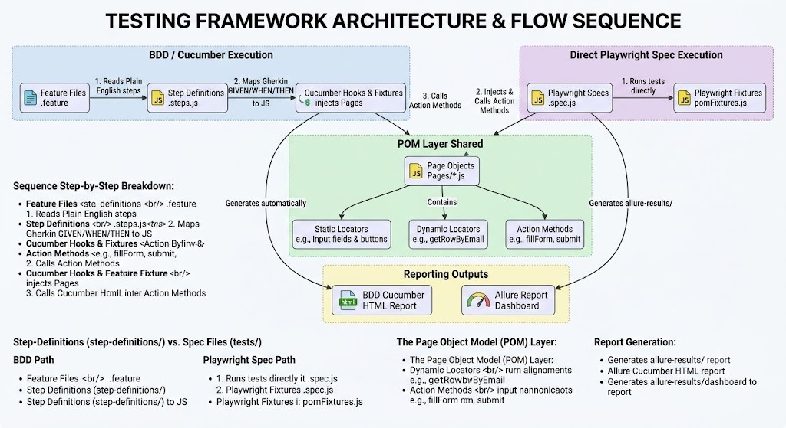

# 🎭 Playwright + Cucumber BDD Test Automation Framework

A state-of-the-art end-to-end automation testing framework engineered with **Playwright** and **Cucumber.js** using the **Page Object Model (POM)** design pattern. Specially tailored for robust, scalable, and cross-browser automation testing on the [DemoQA Website](https://demoqa.com).

---

## 📐 Framework Architecture & Execution Flow

Below is the conceptual architecture of the testing framework. It illustrates the separation of concerns, the shared POM layer, execution entry points, and reporting engines:



### Execution Paths
The framework supports two parallel execution strategies:

1. **BDD / Cucumber Path**
   - **Feature Files (`.feature`)**: Scenarios written in plain English Gherkin syntax.
   - **Step Definitions (`.steps.js`)**: Maps Gherkin steps (`Given`, `When`, `Then`) directly to executable JavaScript.
   - **Hooks & Fixtures**: Cucumber hooks manage browser life cycle and automatically inject page instances.
   - **Actions & Assertions**: Executes page actions and uses Playwright's auto-retrying assertions.

2. **Direct Playwright Spec Path**
   - **Specs (`.spec.js`)**: Standard Playwright test specifications that execute directly.
   - **Fixtures (`pomFixtures.js`)**: Custom fixtures package page objects, injecting them dynamically into test cases.

---

## 📂 Directory Structure & Components

```text
automation-framework/
├── features/               # 📝 Gherkin feature files (.feature)
├── step-definitions/       # 🔗 Glue code matching Gherkin text to Javascript
├── pages/                  # 🖥️ Page Object Model classes (elements & actions)
├── fixtures/               # 🛠️ Playwright context setup and POM fixtures
├── hooks/                  # 🪝 Cucumber setup & teardown (hooks, ad-blocking)
├── tests/                  # 🧪 Direct Playwright Spec files (.spec.js)
├── test-data/              # 📊 Dynamic factories generating mock datasets
├── config/                 # ⚙️ Environment settings & configuration files
├── reports/                # 📊 Cucumber HTML test reports
├── allure-results/         # 📊 Raw Allure results
└── playwright.config.js    # 🛠️ Playwright runner configuration
```

### 🧩 Shared POM Layer
The core components reside under the `pages/` directory:
- **Static Locators**: Reliable, hardcoded selectors targeting distinct UI components.
- **Dynamic Locators**: Parameterized locator methods (e.g., retrieving items by email/text).
- **Action Methods**: Abstracted sequence steps (e.g., login, form-filling, table searching).

---

## 🚀 Getting Started

### Prerequisites
- [Node.js](https://nodejs.org) (v16+)
- [Git](https://git-scm.com/)

### Installation
Clone the repository and install all dependencies:
```bash
git clone https://github.com/saliksalik/BDD-POM-Playwright-Framework-.git
cd BDD-POM-Playwright-Framework-/automation-framework
npm install
npx playwright install
```

### Running Tests
You can execute either the Gherkin feature scenarios or direct Playwright spec tests:

#### 1. Execute Cucumber (BDD) Tests
```bash
npm test
```

#### 2. Execute Playwright Spec Tests
```bash
npx playwright test
```
To run a specific test file (e.g., Accordion):
```bash
npx playwright test tests/accordian.spec.js
```

---

## 📊 Reporting & Visual Dashboards

The framework outputs detailed execution visual analytics using two reporting solutions:

### 1. Allure Report Dashboard (For Spec Execution)
Allure provides rich, interactive HTML analytics for test execution.

1. **Run Playwright Spec Tests**:
   ```bash
   npx playwright test
   ```
2. **Generate Allure HTML Report**:
   ```bash
   npm run allure:generate
   ```
3. **Open Allure Dashboard**:
   ```bash
   npm run allure:open
   ```
   *Or spin up a local live server immediately:*
   ```bash
   npm run allure:serve
   ```

### 2. BDD Cucumber HTML Report (For Feature Execution)
Cucumber generates native HTML reports directly after running:
1. **Run Cucumber BDD Tests**:
   ```bash
   npm test
   ```
2. **Open the Generated Report**:
   ```bash
   # Windows (PowerShell)
   Start-Process "reports/cucumber-report.html"
   
   # macOS/Linux
   open reports/cucumber-report.html
   ```

---

## 🛠️ Solutions to Complex Automation Challenges

During framework development, several UI edge cases on the DemoQA website were successfully resolved:

*   **Accordion Fade Wrapper**: The locator was targeting the inner paragraph, which never receives the `.show` class in Bootstrap. Corrected by redirecting target to parent `#collapseOne` and `#collapseTwo` wrappers.
*   **Menu Hover Execution**: Standard hover logic was failing due to overlay elements. Resolved by hovering the correct parent item and adding a headless-compatible fallback hover action.
*   **Transition Fades (Tabs)**: Standard `toBeHidden()` assertions fail because fade transitions delay component state shifts. Resolved by validating the absence of the `.active` class instead.
*   **React Web Tables**: DemoQA implements a custom React-based div grid (`.ReactTable`) rather than native `<table>` elements. Locators were custom-written to navigate virtualized DOM grids.
*   **HTML5 Drag & Drop**: Raw mouse coordinates coordinate movements sometimes fail to trigger HTML5 drop handlers. Switched to Playwright's native `dragTo()` API.
*   **Draggable & Viewport Shifts**: Scrolling actions shifted coordinates while drag box positions were being read. Solved by writing a dynamic `dragByOffset()` helper that calculates mouse positions dynamically relative to the viewport.
*   **Sortable Lists (jQuery UI)**: Sortable components require simulated mouse sequences with slight delays to register drag items. Solved with a delayed custom drag-and-drop helper.
*   **Broken Image Load Checks**: Standard checks run before images completely download. Wrapped the `naturalWidth` validation in an asynchronous `expect.poll` loop.
*   **Dynamic Selector Properties**: The locator looked for `/^Hello/`, but the button text changes dynamically. Corrected locator to look directly for `"Visible After 5 Seconds"`.
